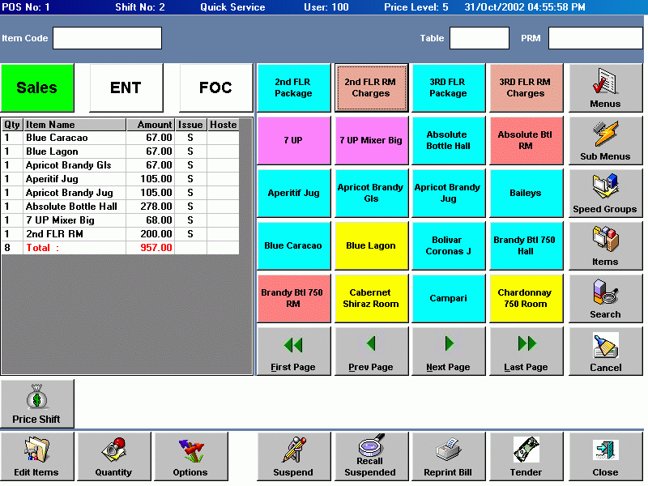



## Touchcontrols

### Description

Hi folks,

Have u ever wanted touch control for touch screen application development. Here is a small contribution from me. I developed 2 control "touch2 - 2 buttons navigation"and "touch4 - 4 buttons navigation". Source included enjoy. Please Leave some comments....
 
### More Info
 
Sql Query

Nill

             |
---                |---
**Submitted On**   |2002-11-13 15:00:56
**By**             |[Samuel Sunadh](https://github.com/Planet-Source-Code/PSCIndex/blob/master/ByAuthor/samuel-sunadh.md)
**Level**          |Advanced
**User Rating**    |4.8 (38 globes from 8 users)
**Compatibility**  |VB 5\.0, VB 6\.0
**Category**       |[Custom Controls/ Forms/  Menus](https://github.com/Planet-Source-Code/PSCIndex/blob/master/ByCategory/custom-controls-forms-menus__1-4.md)
**World**          |[Visual Basic](https://github.com/Planet-Source-Code/PSCIndex/blob/master/ByWorld/visual-basic.md)
**Archive File**   |[Touchcontr14965811132002\.zip](https://github.com/Planet-Source-Code/samuel-sunadh-touchcontrols__1-40677/archive/master.zip)

